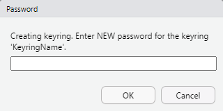
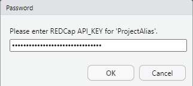
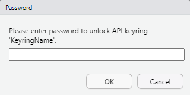

# Introduction

The `redcapAPI` package provides an interface to connect to and interact with a REDCap project. In order to connect to a project, the user must provide the REDCap instance URL and an API token. The token is a 32 character string that serves the purposes of both identifying and authenticating a user. Consequently, API tokens must be treated with the same level of care as user names and passwords. Best practices require that tokens never be stored or displayed in plain text. 

Earlier versions of `redcapAPI` required users to connect to projects using the `redcapConnection` function. It was left to the user to ensure the security of their tokens. However, not all users possess the knowledge or techincal skill to properly secure their tokens. This has resulted in some users exposing their tokens in ways that could compromise the security of their project data. 

This document demonstrates how to improve token security by using `unlockREDCap` in place of `redcapConnection`. It is strongly recommended that users discontinue direct use of `redcapConnection`.

# Connecting to REDCap

Connecting to REDCap using secure token management involves using the following components:

1. keyring name: the name of an encrypted file in which credentials, such as API tokens, may be stored. The user must provide the correct password to unlock the keyring.
2. Project aliases: names provided by the user to refer to a specific REDCap project. 
3. Connection object names: names for `redcapConnection` objects to be added to an R environment. The `redcapAPI` documentation commonly uses the name `rcon` as a connection object name, but any valid R name may be used.
4. REDCap URL: The URL to the user's instance of the REDCap API.
5. API Tokens: The tokens assigned to a user for accessing REDCap projects.

The `unlockREDCap` function guides the user through both the creation of a keyring and adding tokens to the keyring for secure storage. The command that follows shows where each of component belongs in the call:

```{r, eval = FALSE}
unlockREDCap(connections = c(connection_object = "ProjectAlias"), 
             keyring = "KeyringName", 
             url = "https://redcap.[institution].edu/api/", 
             envir = 1)
```

The user should notice that the API tokens are not provided in the call. The tokens will be requested from the user when they keyring is created. Once stored, unlocking the keyring and connecting to projects may be done without ever exposing the API token.

By default, `unlockREDCap` returns connection objects in a list. Using `envir = 1` will, instead, directly add the connection objects to the current environment.

After a keyring has been unlocked, it remains unlocked for the duration of the R session. In other words, the keyring will remain unlocked until the user closes R.

### Important Note on R/RStudio defaults

The encrypted keyring file can be done via the OS or via a local library. The default for the `keyring` package is the OS. On MacOS has caused a lot of users problems, as with each recent update Apple has changed the interface. This has at times resulted in repeated requests for the password, and occasionally an outright failure to work. To prevent this we recommend setting the default to be a local encrypted file in ones user directory.

Further, R's default of saving user data locally can inadvertantly save an API_KEY in plain text files locally. It is better to set the quit function for R command line to never save data files. If one is using R studio, this needs to be set under "Tools -> Global Options" and on the Basic tab, make sure that "Restore .RData into workspace at startup:" is not select. Also "Save workspace to .RData on exit:" should be set to NEVER.

To do this execute `usethis::edit_r_profile()` and this opens a file that will execute every time the user starts R. Add the following to this file:

```
options(keyring_backend=keyring::backend_file)

utils::assignInNamespace(
  "q",
  function(save="no", status=0, runLast=TRUE)
  {
    .Internal(quit(save, status, runLast))
  },
  "base"
)
```

## Creating a New Keyring

When executed, `unlockREDCap` will first look to see if a keyring named `"KeyringName"` exists. If it cannot find a keyring by that name, it will then create the keyring and prompt the user to provide the password for the keyring.



After the creating the password, the user will then be prompted to enter the token for each connection object listed in the `connections` argument. 



When all of the tokens have been created, `unlockREDCap` will test the connection to each project and finally return connection objects for use. 

## Unlocking an Existing Keyring

If the keyring already exists on the system, the next time `unlockREDCap` is called, it will prompt the user to enter the password for they keyring. 



After unlocking the keyring, `unlockREDCap` then looks for new project aliases. If any project aliases have been added, the user is prompted to add the API tokens for those projects. 

## Managing Multiple Tokens

An important feature of they keyrings implemented by `unlockREDCap` is that a single keyring can hold any number of API tokens. Similarly, `unlockREDCap` can establish connections to any number of projects. The following command will create a three connection objects in the global environment.

```{r, eval = FALSE}
unlockREDCap(connections = c(rcon_musician = "MusicianStudy", 
                             rcon_education = "EducationStudy", 
                             rcon_screen = "ScreenTimeStudy"), 
             keyring = "KeyringName", 
             url = "https://redcap.[institution].edu/api/", 
             envir = 1)

MusicianData <- exportRecordsTyped(rcon_musician)
EducationData <- exportRecordsTyped(rcon_education)
ScreenTimeData <- exportRecordsTyped(rcon_screen)
```

# Conclusion

Proper API token management is critical to maintaining the data security of a REDCap project. By using `unlockREDCap`, users are able to securely store and manage all of their API tokens; accessing REDCap projects may be done without exposing the tokens in the code. Users are encouraged to discontinue direct use of `redcapConnection` in favor of `unlockREDCap`.


# Frequently Asked Questions

## Forgotten Password

_I forgot the password to my keyring. How do I access my keyring?_

There is no mechanism for recovering the password to a keyring. Instead, the user will need to delete the keyring and recreate it. Once the keyring is deleted, `unlockREDCap` will guide the user through establishing a new password and storing the API tokens. 

To delete a keyring, use the command

```{r, eval = FALSE}
keyring::keyring_delete("KeyringName")
```

## Changed Token

_I requested a new token for one of my projects. How do I update my keyring?_

To update an API token for a project with the alias `"ProjectAlias"` on the keyring `"KeyringName"`, the following command may be used:

```{r, eval = FALSE}
keyring::key_set_with_value("ProjectAlias", 
                            "ProjectAlias", 
                            keyring = "KeyringName", 
                            password = "[NEW API TOKEN]")
```
