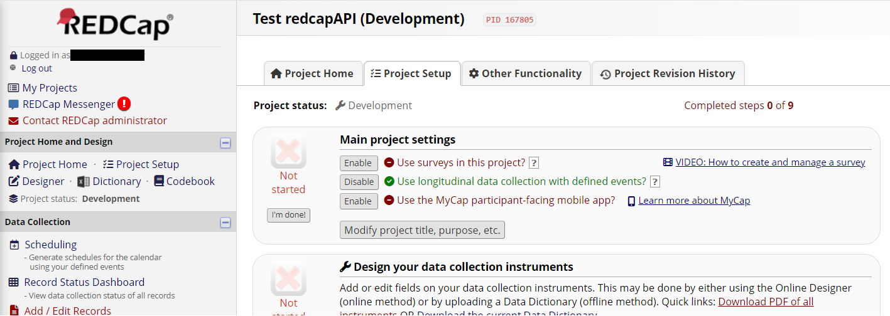
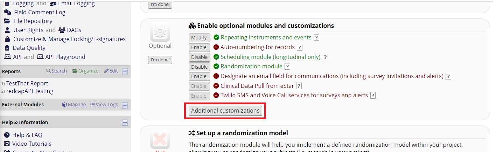
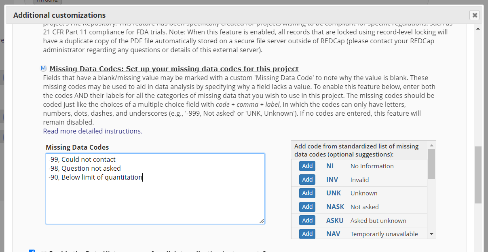
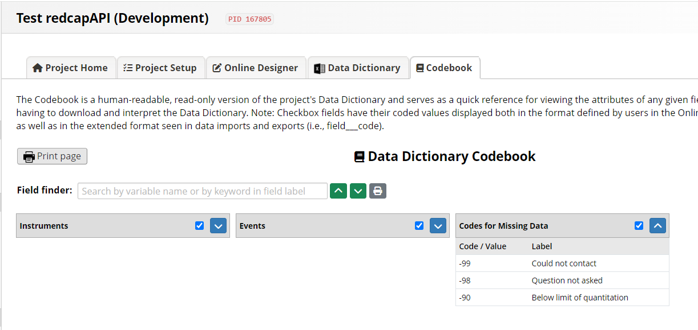

# Introduction

The addition of `exportRecordsTyped` opened a great deal of flexibility and potential for customization when exporting data from REDCap and preparing them for analysis. The tasks of preparing data are broadly categorized into three phases

1. Missing Value Detection 
2. Field Validation
3. Casting Data

This document will focus on missing data detection and customizations to fit the user's preferences. 

```{r, result = 'hide', message = FALSE, warning = FALSE}
library(redcapAPI)
url <- "https://redcap.vanderbilt.edu/api/" # Our institutions REDCap instance

unlockREDCap(c(rcon = "Sandbox"), 
             envir = .GlobalEnv,
             keyring = "API_KEYs", 
             url = url)
```

```{r, echo = FALSE, message = FALSE, warning = FALSE, results = 'hide'}
ExistingProject <- preserveProject(rcon)
purgeProject(rcon, purge_all= TRUE)
load("data/MissingDataVignetteData.Rdata")

importArms(rcon, Arms)
importEvents(rcon, Events)
importMetaData(rcon, MetaData)
importRecords(rcon, Records)
```

# Missing Data Detection

Missing data detection operates in a similar manner to casting data (see `vignette("redcapAPI-casting-data", package = "redcapAPI")`). When data are exported from REDCap, the field type of each field is determined and an appropriate function is applied to the field to determine which, if any, values are missing. This section describes the default behavior of missing data detection and discusses how to customize these behaviors.

## Default Detection Behavior

When testing fields for missing values, all field types are tested using the `isNAorBlank` function. This function identifies two values as missing data

* The R missing value `NA`
* Empty strings, i.e. `""`

The empty strings are treated as missing values because this is how REDCap represents missing values in the data export. When exporting data `exportRecordsTyped` will convert empty strings to `NA`. Conversely, `castForImport` will convert `NA` values to empty strings to prepare the data for import.

## Customizing Missing Data Detection For a Field Type

Circumstances may arise where the user wishes to treat other values as missing. Consider a situation where medical records are being reviewed to identify the number of days elapsing between the date of a diagnosis and the date of the associated surgery. During the records review, researchers may be unable to determine the number of days because either the date of diagnosis is not recorded in the record or the date of surgery is not recorded. The researchers then decide to record `-99` when the date of diagnosis is not recorded and `-98` when the date of surgery is not recorded. While this information may be relevant to researchers in understanding why data are missing, the analysis data set is unconcerned with why the data are missing and needs to code both values as `NA`.

Detecting these values as missing data is done by first defining a function to include `-99` and `-98` as missing values. The function must return a logical value where `TRUE` indicates a missing value. 

```{r}
isMissingSpecial <- function(x, ...){
  is.na(x) | x == "" | x %in% c(-98, -99)
}

#####################################################################
# Use the default missing data detection
Rec <- exportRecordsTyped(rcon, 
                          fields = c("days_between"))
Rec

#####################################################################
# Use the custom missing data detection
Rec <- exportRecordsTyped(rcon, 
                          fields = c("days_between"), 
                          na = list(number = isMissingSpecial))
Rec
```

## Customizing Missing Data Detection For a Specific Field

Additional arguments may be passed to the missing value detection function in order to single out specific fields. This allows for missing value detection to be customized for each field, even if there are multiple fields within a field type.  In this example, the `isMissingSpecialField` function only identifies `-98` and `-99` as missing values for `days_between`, but not for `days_between_duplicate`.

```{r}
isMissingSpecialField <- function(x, field_name, ...){
  if (field_name == "days_between"){
    is.na(x) | x == "" | x %in% c(-98, -99)
  } else {
    isNAorBlank(x, ...)
  }
}

#####################################################################
# Use the custom missing data detection
Rec <- exportRecordsTyped(rcon, 
                          fields = c("days_between", 
                                     "days_between_duplicate"), 
                          na = list(number = isMissingSpecialField))
Rec
```

It is possible to customize missing data detection for any field type listed in the appendix. In this example, the `isMissingSpecialField` is extended to include the `dropdown_example` field in identifying the values `-98` and `-99` as missing data.

```{r}
isMissingSpecialField <- function(x, field_name, ...){
  if (field_name %in% c("days_between", 
                        "dropdown_example")){
    is.na(x) | x == "" | x %in% c("-98", "-99")
  } else {
    isNAorBlank(x, ...) 
  }
}

#####################################################################
# Use the custom missing data detection
Rec <- exportRecordsTyped(rcon, 
                          fields = c("days_between", 
                                     "days_between_duplicate", 
                                     "dropdown_example", 
                                     "dropdown_example_duplicate"),
                          na = list(number = isMissingSpecialField, 
                                    dropdown = isMissingSpecialField))
Rec
```

\clearpage

# Project Level Missing Data Codes

Users of a project may designate missing data codes for the entire project. These codes will not be apparent in the data dictionary, and they cannot be accessed through the API. Thus, `redcapAPI` will be entirely unaware of their existence. When project-level missing data codes have been defined, the user may notice a high volume of failed validations when exporting data via `exportRecordsTyped`. 

## Identifying Projects with Project-Level Missing Data Codes

There are two places in the REDCap User Interface where the user may determine if project-level missing data codes have been defined. Users who have access to the project set up can see the definitions through **Project Setup > Additional Customizations > Missing Data Codes**. The following images illustrate how to find these in the user interface.


From this page, scroll down to the "Additional Customizations" button. 




Another place the user may find project-level missing data codes is in the codebook. The next image shows what these look like:



## Applying Project-Level Missing Data Codes To All Fields

It is usually desirable to apply project-level missing data codes to all fields. Unfortunately, these codes are not accessible via the API, so it is up to the user to identify if a project has missing data codes and to apply them. This can be accomplished relatively easily by defining a custom function and submitting it to the `na_values` function. 

For the codes used in the images above, the user could apply the missing data codes in the following way:

```
customMissingDetection <- function(x, ...){
  is.na(x) | x == "" | x %in% c(-90, -98, -99))
}

exportRecordsTyped(rcon, 
                   cast = special_cast, 
                   na = na_values(customMissingDetection))
```

## Project-Level and Field-Specific Missing Data Codes 

It is possible for a project to have project-level missing data codes and to also have fields with their own field-specific missing data codes. Missing data detection in this scenario is somewhat more complicated, but still manageable. The user may define their custom function with a `field_name` argument and process individual fields in whatever special way is needed.

For this example, suppose a radio button field, "final_evaluation", has a missing data code where -10 means "incomplete forms."

```
customMissingDetection <- function(x, field_name, ...){
  is_project_na <- is.na(x) | x == "" | x %in% c(-90, -98, -99))
  
  is_field_na <- 
    if (field_name == "final_evaluation"){
      x %in% -10
    } else {
      FALSE
    }
    
  is_project_na | is_field_na
}

exportRecordsTyped(rcon, 
                   cast = special_cast, 
                   na = na_values(customMissingDetection))
```

\clearpage
# Appendix

## Missing Data Detection Field Types

* `calc`: Calculated fields.
* `checkbox`: Checkbox fields.
* `date_`: Text fields with the "Date" validation type. 
* `datetime_`: Text fields with the "Datetime" validation type.
* `datetime_seconds_`: Text fields with the "Datetime with seconds" validation type.
* `dropdown`: Drop down multiple choice fields.
* `float`: Text fields with the "Number" validation type.
* `form_complete`: Fields automatically added by REDCap indicating the completion status of the form.
* `int`: Text fields with the "Integer" validation type. This appears to be a legacy type, and integer appears to be used by more recent version of REDCap.
* `integer`: Text fields with the "Integer" validation type.
* `number`: Text fields with the "Number" validation type.
* `number_1dp`: Text fields with the "number (1 decimal place)" validation type.
* `number_1dp_comma_decimal`: Text fields with the "number (1 decimal place - comma as decimal)" validation type.
* `number_2dp`: Text fields with the "number (2 decimal place)" validation type.
* `number_2dp_comma_decimal`: Text fields with the "number (2 decimal place - comma as decimal)" validation type.
* `radio`: Radio button fields.
* `select`: Possible alias for `dropdown` or `radio`.
* `sql`: Fields that use a SQL query to make a drop down tools from another project.
* `system`: Fields automatically provided by REDCap for the project. These include `redcap_event_name`, `redcap_data_access_group`, `redcap_repeat_instrument`, and `redcap_repeat_instance`.
* `time_mm_ss`: Text fields with the "Time (MM:SS)" validation type.
* `time_hh_mm_ss`: Text fields with the "Time (HH:MM:SS)" validation type.
* `truefalse`: True - False fields.
* `yesno`: Yes - No fields.


```{r, echo = FALSE, message = FALSE, results = 'hide', error = TRUE}
purgeProject(rcon, purge_all = TRUE)
importProjectInformation(rcon, ExistingProject$project_information)
importArms(rcon, ExistingProject$arms)
importEvents(rcon, ExistingProject$events)
importMetaData(rcon, ExistingProject$meta_data)
importMappings(rcon, ExistingProject$mappings)
importRepeatingInstrumentsEvents(rcon, ExistingProject$repeating_instruments)
importRecords(rcon, ExistingProject$records)
```
